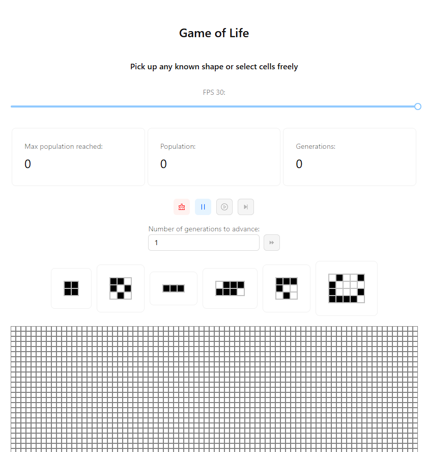

# Game of Life

This project is an implementation of [Conway's Game of Life](https://en.wikipedia.org/wiki/Conway%27s_Game_of_Life), developed as a study and to complete a code challenge.

You can try it live on this Cloudflare deployment:  
🔗 [Play the Game](https://gameoflife-9jh.pages.dev/)



---

## 🚀 Technologies

- **React** for building the user interface
- **Vite** for fast build and development
- **PNPM** as the package manager
- **Node.js** version `24.0.0`

---

## 🛠️ Getting Started

### Prerequisites

Make sure you have the correct Node.js version and `pnpm` installed:

- Install Node.js → [Node.js Docs](https://nodejs.org/en)
- Install PNPM → [PNPM Docs](https://pnpm.io/installation)

### Running the Project

1. Clone the repository
2. Install dependencies:

   ```bash
   pnpm install
   ```

3. Run the development server:

   ```bash
   pnpm dev
   ```

Open `http://localhost:5173/` in your browser.

---

### 📦 Useful Scripts

Here are some available scripts from package.json:

| Script         | Description                          |
| -------------- | ------------------------------------ |
| `pnpm dev`     | Start the development server         |
| `pnpm build`   | Create an optimized production build |
| `pnpm preview` | Preview the production build locally |
| `pnpm lint`    | Run ESLint on the codebase           |
| `pnpm test`    | Run unit tests (if configured)       |

---

### 📁 Project Structure

For a breakdown of the internal folder organization, see [FOLDER_STRUCTURE.md](https://github.com/FelipeMathieu/GameOfLife/blob/main/docs/folder-structure.md).

---

### 🧠 About Conway's Game of Life

Conway's Game of Life is a zero-player simulation where cells live, die, or multiply based on mathematical rules. It is a classic example of cellular automata, producing complex patterns from simple logic.

---

### 📬 Feedback & Contributions

Feel free to fork, open issues, or contribute to the project! Feedback is always welcome.
